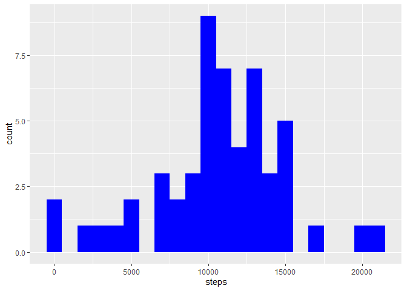
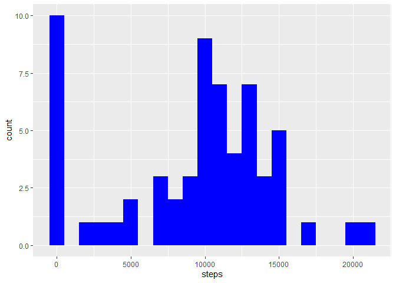

## Loading and preprocessing the data
Unzip data to obtain a csv file.


```r
library(data.table)
library(tidyverse)
```

```
## -- Attaching packages --------------------------------------- tidyverse 1.3.0 --
```

```
## v ggplot2 3.3.2     v purrr   0.3.4
## v tibble  3.0.3     v dplyr   1.0.1
## v tidyr   1.1.1     v stringr 1.4.0
## v readr   1.3.1     v forcats 0.5.0
```

```
## -- Conflicts ------------------------------------------ tidyverse_conflicts() --
## x dplyr::between()   masks data.table::between()
## x dplyr::filter()    masks stats::filter()
## x dplyr::first()     masks data.table::first()
## x dplyr::lag()       masks stats::lag()
## x dplyr::last()      masks data.table::last()
## x purrr::transpose() masks data.table::transpose()
```

```r
unzip("activity.zip")
```
## Reading csv data into Data.table

```r
d <- fread('activity.csv')
d$date <- as.Date(d$date)
```

## What is mean total number of steps taken per day?

1. Calculate the total number of steps taken per day


```r
sl <- d[, c(lapply(.SD, sum, na.rm = FALSE)), .SDcols = c("steps"), by = .(date)]
```

2. If you do not understand the difference between a histogram and a barplot, research the difference between them. Make a histogram of the total number of steps taken each day. 

```r
ggplot(sl, aes(x = steps)) +
        geom_histogram(fill = "blue", binwidth = 1000)
```

```
## Warning: Removed 8 rows containing non-finite values (stat_bin).
```

<!-- -->


3. Calculate and report the mean and median of the total number of steps taken per day

```r
(DailyStepsMean <- mean(sl$steps, na.rm = TRUE))
```

```
## [1] 10766.19
```

```r
(DailyStepsMeadian <- median(sl$steps, na.rm = TRUE))
```

```
## [1] 10765
```


## What is the average daily activity pattern?
1. Make a time series plot (i.e. 𝚝𝚢𝚙𝚎 = "𝚕") of the 5-minute interval (x-axis) and the average number of steps taken, averaged across all days (y-axis)


```r
int <- d[, c(lapply(.SD, mean, na.rm = TRUE)), .SDcols = c("steps"), by = .(interval)] 

ggplot(int, aes(x = interval, y = steps)) +
        geom_line()
```

<!-- -->

2. Which 5-minute interval, on average across all the days in the dataset, contains the maximum number of steps?


```r
int[which.max(int$steps), 1]
```

```
##    interval
## 1:      835
```


## Imputing missing values
1. Calculate and report the total number of missing values in the dataset (i.e. the total number of rows with 𝙽𝙰s)


```r
d[is.na(steps), .N ]
```

```
## [1] 2304
```

```r
# or
sum(is.na(d$steps))
```

```
## [1] 2304
```

2. Devise a strategy for filling in all of the missing values in the dataset. The strategy does not need to be sophisticated. For example, you could use the mean/median for that day, or the mean for that 5-minute interval, etc.


```r
# Using median for filling missing values of dataset.
d[is.na(steps), "steps"] <- d[, c(lapply(.SD, median, na.rm = TRUE)), .SDcols = c("steps")]
```

3. Create a new dataset that is equal to the original dataset but with the missing data filled in.


```r
data.table::fwrite(x = d, file = "tidyData.csv", quote = FALSE)
```


4. Make a histogram of the total number of steps taken each day and calculate and report the mean and median total number of steps taken per day. Do these values differ from the estimates from the first part of the assignment? What is the impact of imputing missing data on the estimates of the total daily number of steps?


```r
# Number of steps per day
totalSteps <- d[, c(lapply(.SD, sum)), .SDcols = c("steps"), by = .(date)] 

# mean
mean(totalSteps$steps)
```

```
## [1] 9354.23
```

```r
# median
median(totalSteps$steps)
```

```
## [1] 10395
```


```r
# histogram of the total number of steps taken each day
ggplot(totalSteps, aes(x = steps)) + geom_histogram(fill = "blue", binwidth = 1000)
```

<!-- -->

These values differ from the estimates from the first part of the assignment:

First part (with NAs) | Second part (filling NAs with median)
--- | ---
mean = 10766.19 |  mean = 10766.19
median = 10765 |  median = 10395


## Are there differences in activity patterns between weekdays and weekends?


